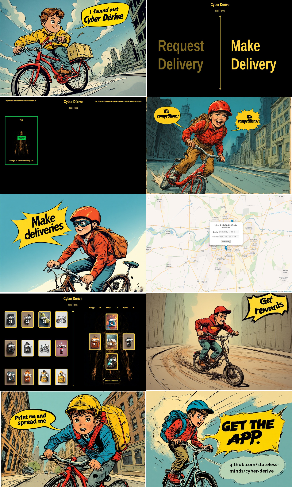

# Cyber Dérive

**"Deliver for fun!"**



---

## The Premise

Cyber Dérive is a p2p local delivery app turned into a deck-building game with collectible magic cards and battles.

In a world of alienation where people rely on companies and centralized institutions to do everything for them Cyber Dérive offers a fresh take on rebuilding community interaction and trust. 

<a href="https://en.wikipedia.org/wiki/D%C3%A9rive">"The dérive (French: [de.ʁiv], "drift") is an unplanned journey through a landscape, usually urban, in which participants stop focusing on their everyday relations to their social environment."</a>

---

## Core Principles

- **Boost trust in your community**
- **Experience the city in a new authentic way**
- **Reduce unneccessary traffic and have fun by making better use of your existing journeys**
- **Convert local deliveries into a common good**
- **Promote collaboration and team work**

---

## How it works

**1. Need something delivered within your city?** 
- Request a delivery
- Someone can deliver it for you while they go out on their daily matters 
- Free of charge

**2. Need a reason to go out more often, stay fit and make new friends?**
- V1 - Competition mode
- Open the app
- Get 12 random magic cards
- Equip your avatar with up to 5 of them and enter competition
- Afterwards upon entering new competition you can swap 1 of your cards
- Others join the competition
- Win the competition and deliver the item
- Choose your reward from 12 special magic cards
- Select one and swap one of your existing cards
- Enter new competitions stronger with friends

**3. A delivery route is too long for a single person?**
- V2 - Cooperative mode - TBA
- Post where you can take it to
- Someone else can take it from there
- When multi-party completes a delivery by team work they form a guild
- Guilds get the biggest rewards - one magic card per member on successful delivery**


## Installation

The app runs on the public IPFS network. In order to use it follow the steps below:

1. Install Linux
2. Install IPFS Companion http://docs.ipfs.io/install/ipfs-companion/
3. Install golang 1.20 or later version - https://go.dev/doc/install
4.  Clone https://github.com/stateless-minds/kubo to your local machine
`git clone https://github.com/stateless-minds/kubo.git`
5. Build IPFS
`make build`
6. Init IPFS
`./cmd/ipfs/ipfs init`
7.  Follow the instructions here to open your config file: https://github.com/ipfs/kubo/blob/master/docs/config.md. Usually it's `~/.ipfs/config` on Linux. Add the following snippet to the `HTTPHeaders`:
```
  "API": {
    "HTTPHeaders": {
      "Access-Control-Allow-Origin": ["webui://-", "http://http://k51qzi5uqu5dgr1liqgrp414mh8ft6an3fpbfx4gbzk14kljw22kvg342t0dq8.ipns.localhost:8080", "http://127.0.0.1:5001", "https://webui.ipfs.io"],
      "Access-Control-Allow-Credentials": ["true"],
      "Access-Control-Allow-Methods": ["PUT", "POST"]
    }
  },
 ```
8. Run the daemon:
+ `.cmd/ipfs/ipfs daemon --enable-pubsub-experiment`

9.  Navigate to <a href="https://ipfs.io/ipns/k51qzi5uqu5dgr1liqgrp414mh8ft6an3fpbfx4gbzk14kljw22kvg342t0dq8">Cyber Dérive</a>
10.  Pin it to your local node so that you cohost it every time your IPFS daemon is running
```
10.1. Open your IPFS dashboard

http://127.0.0.1:5001/webui

10.1 In your CLI with a running daemon run:

./cmd/ipfs/ipfs name resolve k51qzi5uqu5dgr1liqgrp414mh8ft6an3fpbfx4gbzk14kljw22kvg342t0dq8

Expected result for example:
/ipfs/QmZrgju4wYEXtDtS9ZeKjnVmR9tmzpe9BAhTmXa8BPyEsM

10.2. In the search bar of the web UI search for QmHash by pasting: QmZrgju4wYEXtDtS9ZeKjnVmR9tmzpe9BAhTmXa8BPyEsM
10.3 Click on More
10.4 Click Set Pinning
10.5 Mark local node and hit Apply
```

## FAQ

**1. Would delivery companies tolerate this?**
 - Yes, delivery companies make their profit margins from long-distance deliveries in bulk. Local offices and car fleet are a cost not a profit for them. They would gladly give up on this if people can deliver parcels themselves to their depots. This way they can spend money on trucks, trains and larger depots to increase their long range fleet.

**2. How is theft/fraud prevented without regulation?**
 - There is a reputation system in place. If someone steals your parcel or deceives you in some way you can report it via the abuse/fraud button. On 3 strikes the person is banned from the platform. All users are pseudonymous. This means that their IPs are public and traceable thus you can sort the dispute yourself.

**3. What is the maximum weight of a parcel?** 
- There are no defined limits. People can deliver by foot, bicycle, e-scooter or their personal car. Thus it all depends on the means of transportation in use and a personal evaluation.

**4. Is this activity legal?**
- Of course it's legal. There is no money involved thus it's non-commercial. It's voluntary and no one owns the platform. The app is hosted and operated on a p2p basis thus each user is Cyber Dérive. The source code is open-source and everyone can clone, fork and adapt for their own city and needs.

**5. What happens in case of road accident?**
- The same as it would happen without the game. Use at your own risk. Cyber Dérive is not responsible for your own actions.

**6. What happens in case of crime-related activities and/or forbidden substances/items?**
- Cyber Dérive is not responsible for what is being carried. Each user is solely responsible for own actions. There is no moderation or central authority that governs the activity in the game.

**7. What about privacy and personal data?**
- Cyber Dérive does not collect any personal information. The only identifier is your PeerID which can reveal your IP address in case of misbehavior.

**8. Are there age restrictions?**
- No, the game is available to all ages but is generally recommended for 10 to 18.